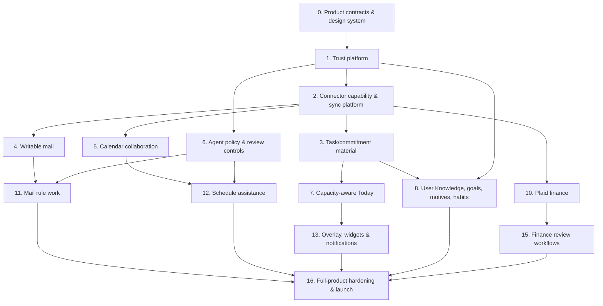

# nohmi — Complete Implementation Plan

- Status: Proposed execution plan
- Date: 2026-07-18
- Last reconciled: 2026-09-10
- Companion: [Master Product & Experience Design](./master-design.md)
- Scope: every capability in the master design. Phases are dependency order, not a reduction in product ambition.

## 1. Program rules

1. No feature may bypass the API/domain service, policy engine, audit model, or connector capability matrix.
2. A feature is not complete when its happy-path UI works; it also needs authorization, provider failure, offline/stale, audit, accessibility, mobile, and automated-test coverage.
3. Build reusable primitives/data contracts before individual screens. If a phase finds a missing shared concept, add it to the domain model rather than creating a page-only workaround.
4. Preserve the existing MVP during migration. Feature flags and capability-gated routes keep partially delivered surfaces honest.
5. Inferred knowledge and action authority have separate lifecycles. Safely reinforced knowledge may
   become active automatically, while promotion to Rule-authorized behavior requires the applicable
   domain policy, evidence, review, and immediate revoke or recovery path.
6. A unified view is built with typed links and projections over native domain records, never by collapsing provider events, mail threads, finance transactions, and local commitments into one generic mutable row.
7. The repository coverage floor (95% statements/functions/lines and 94% branches) is a required signal, not a substitute for release evidence. High-risk work also requires contract, deterministic connector-simulator, migration/recovery, accessibility, visual, offline, and adversarial-policy tests.

## 2. Cross-cutting workstreams

| Workstream | Responsibility |
| --- | --- |
| Domain/API | Schemas, policy evaluation, source links, audit, OpenAPI, idempotency, migrations. |
| Connectors | Google, iCloud, Plaid capability contracts, write-through sync, reconciliation, conflict handling. |
| Agent controls | Workspace capability policy, review queues, daily-brief projection, and bounded domain-owned workers. |
| User Knowledge | Typed personal context, relationships, goals, provenance, reinforcement, promotion, semantic retrieval, and purpose-bound context packs. |
| Web/desktop/mobile | Shared shadcn blocks, responsive app, Tauri overlay, widgets, accessibility. |
| Security/privacy | Credentials, encryption, consent, retention, export/delete, session/token lifecycle. |
| Quality/operations | Test fixtures, deterministic environment actions, E2E, visual/accessibility checks, observability, recovery runbooks. |

## 3. Dependency map

## 4. Detailed epics and completion criteria

### Epic 0 — Product contracts, design system, and migration inventory

**Implement**

- Create a capability inventory for every current route, endpoint, connector operation, MCP tool, data table, and deferred item in `mvp.md`.
- Execute the repository-wide naming hard cutover defined in [`naming.md`](naming.md): use
  `personal-os` for internal implementation identifiers, lowercase `nohmi` for the product and
  public agent surface, remove every former-name occurrence without compatibility aliases, and
  coordinate deployed domains, callbacks, protocols, infrastructure, clients, skills, and rollback.
- Adopt `master-design.md` as the source of future UX/architecture decisions; update ADRs when a decision changes accepted system shape.
- Finish the shared shadcn component registry and remove bespoke controls from settings and new surfaces. Add app-level layout blocks: global sidebar/top bar, command header, context sidebar, material list, inspector, editor, approval row, run row, source badge, sync state, empty/error/offline states.
- Formalize semantic tokens, Plus Jakarta Sans/DM Mono typography, color-theme propagation, grid/spacing, desktop/mobile breakpoints, and visual regression baselines.
- Create a route/feature-flag registry so placeholders, beta surfaces, and unavailable provider operations are clearly marked.

**Done when**

- Every new control has a generated shadcn primitive and every shared page state is reusable.
- Design QA confirms that sidebar geometry and action columns do not change with selected content.
- The capability inventory has a row for every design requirement in the master design and a future owner epic.
- A case-insensitive scan of tracked and generated repository files reports zero former-name
  occurrences, and production evidence confirms the coordinated cutover is healthy.

### Epic 1 — Trust platform: identity, access, policy, audit, and privacy

**Implement**

- Persistent/revocable browser sessions, device/session list, logout-all, recovery-ready account model, and human-visible session activity.
- Expand personal access tokens to material/action/source scopes, expiry, name, last used, rotation, revoke, and plain-language presets.
- Build central policy engine with Allow/Preview/Approve Each/Approve Batch/Rule-authorized/Blocked evaluation, approval expiry, and emergency stop.
- Treat externally sourced mail, calendar, attachment, web, and imported text as untrusted content; carry origin labels through agent context and enforce source-to-sink controls for external sharing, sensitive mutations, and cross-domain actions.
- Make Streamable HTTP MCP a standards-compliant OAuth protected resource with resource metadata, audience binding, short-lived credentials, incremental step-up scopes, and server-side scope/policy enforcement. Keep local stdio credentials short-lived and independently revocable.
- Add source selection filters to scopes: provider, account, mailbox, calendar, financial account, and date bounds where appropriate.
- Extend immutable redacted audit records with policy decision, rule/run/token/connector revision, before/after references, undo/recovery result, and correlation IDs.
- Add privacy center: agent context selection, notification preview policy, export, deletion, retention, sensitive-domain warnings, and consent records.

**Done when**

- A token cannot access unselected material even if a client requests it directly.
- A policy decision is reproducible from its recorded inputs.
- Revocation stops new calls/runs immediately and pending work resolves to blocked/cancelled, never allowed.

### Epic 2 — Connector capability, synchronization, and reconciliation platform

**Implement**

- Define provider-neutral contracts/capabilities for mail read/manage/send, calendar read/write/RSVP/availability, attachments, webhooks, and finance sync.
- Establish the typed material-link/source-reference contract before linking email to tasks, calendar events to busy mirrors, finance items to review queues, or agent proposals to source evidence. The contract records relation type, source/provider identity, source revision, projection state, ownership, and audit/policy reference.
- Expand connection model with incremental Google OAuth capability grants, multi-account state, selected sources, health, cursor, last successful sync, retry/reconnect state, and capability discovery.
- Harden iCloud IMAP/CalDAV Apple-authorization connection where supported, with app-password fallback, capability toggles, source discovery, encryption, health checks, password-revocation recovery, and reconnection.
- Create durable connector sync jobs with cursor checkpoints, idempotency, lock/lease, provider rate-limit backoff, dead-letter queues, stale status, and reconciliation. Provider-requested full sync rebaselines only the normalized projection/cursor; it preserves user-owned annotations, rules, links, local material, approvals, and audit evidence.
- Implement normalized projection revision/conflict/tombstone/source-link contracts and connector simulation fixtures for success, conflict, partial sync, outage, revocation, and duplicate source cases.

**Done when**

- Every UI/MCP action uses capability checks and the provider is authoritative for connected material.
- Sync retries cannot produce duplicate events/messages/transactions or hide a provider failure.
- A user can understand source freshness and repair a broken connection without losing account selection.
- A forced provider resync replaces only the provider projection/cursor and demonstrably preserves user-created links, annotations, rules, local material, approvals, and audit references.

### Epic 3 — Commitment graph: reminders, tasks, projects, recurrence, and time blocks

**Implement**

- Migrate reminders into a commitment model while retaining existing IDs/API compatibility.
- Add task fields: project, long-lived organizational container, status, priority, estimate, due versus scheduled time, recurrence/exception, subtasks/checklists, tags, notes, attachments, energy/context, sources, goals/motives, defer/complete history.
- Add projects, long-lived organizational containers, task inbox, upcoming/someday/completed/custom filters, list/board/calendar/timeline/focus views, bulk actions, search, quick capture, natural-language parse confirmation, and keyboard commands. Retain **Lists** as the provisional label, do not assume **Areas**, and allow a later product review to change the label without changing the hierarchy.
- Import tasks from external providers once and make nohmi the authoritative working workspace
  afterward. Allow a person to re-trigger a heavily rate-limited, auditable import that adds new
  source commitments, deduplicates stable provider identities and bounded fingerprints, and sends
  source conflicts to review without silently overwriting nohmi-owned edits. Preserve continuous
  inbound and bidirectional multi-provider synchronization as possible future extensions, not
  current delivery requirements.
- Build recurrence service for calendar and completion-relative patterns, occurrence exceptions, edit-one/edit-series semantics, and future preview.
- Build internal/external time blocks with duration, actual time, privacy/busy setting, destination calendar, drag/resize, keyboard alternatives, and rollback.
- Add focus timer/Pomodoro, break/interrupt capture, and low-distraction focus mode.

**Done when**

- A task remains linked to its source email/event/note and any scheduled block without duplicate source-of-truth state.
- All time block operations work by keyboard and pointer and preserve provider failure recovery.
- Recurring task edge cases have unit/integration/E2E coverage.

### Epic 4 — Calendar collaboration, scheduling, and schedule health

**Implement**

- Extend event schema/connector mapping for attendees, organizer, response status, availability/free-busy, visibility, conferencing, attachments, provider link, UID, event type, and travel/buffer relationships.
- Implement full event editor/inspector, 15-minute day/week/month/agenda canvas, current time, timezone/date controls, saved calendar sets, search, focus/out-of-office, source state, keyboard/pointer move/resize, copy/move.
- Implement RSVP and invitation update flows, optional response messages, source-mail linkage, revision conflict resolution, and agent recommendation preview.
- Implement availability aggregation, private-detail masking, scheduling links, booking windows, proposals, reschedule/cancel, conferencing/location policy, and conflict avoidance.
- Implement source-to-destination busy mirroring with privacy modes, loop prevention, linked lifecycle/reconciliation, de-duplication in the unified canvas, and audit/restore behavior.
- Implement travel-time/buffer/meals/breaks/focus preferences and schedule-health analysis/proposals.

**Done when**

- An event is visible once while its busy block still protects availability in selected work calendars.
- Invite and provider conflict behavior is explicit, reversible where supported, and test-covered.
- Availability never exposes a private title/notes/location without the selected privacy mode.

### Epic 5 — Writable inbox, rules, and message-to-commitment workflows

**Implement**

- Request Google incremental mail-manage/send and, separately, Gmail settings/filters scopes only through explicit connection/settings actions. Add OAuth verification, restricted-scope server-storage/security-assessment, and Google policy readiness as a release blocker. Prefer Apple Account authorization for iCloud where supported and use app-specific-password access as an encrypted, revocation-aware fallback.
- Add message mutation service: read/unread, labels/folders, archive, move, star/priority, spam/not spam, trash, snooze, standards/provider-supported unsubscribe, draft/reply/forward/send, batch operations, and provider-appropriate undo/restore. Permanent delete is a distinct provider capability, never the meaning of an ordinary "delete" action.
- Build complete mail IA: unified/account/mailbox/search/smart folder/category/priority/needs-reply/newsletter/notification/invitation/drafts/archive/spam/trash views with account identity and freshness.
- Build triage session, bulk selection/shortcuts, thread inspector, safe body/attachment rendering, action confirmation, undo/status, and source badges.
- Build extraction flows for task, reminder, event/invite, receipt/transaction lead, contact/note/follow-up; preserve source links and extracted-field review.
- Build deterministic and agent-assisted rules with conditions, confidence, dry-run candidate list, effective date, policy, versioning, audit, metrics, disable, and rollback review.

**Done when**

- Any mail mutation has an agent policy and a direct-human equivalent flow.
- No send/delete/spam/unsubscribe can occur through a missing confirmation/policy branch.
- Bulk selections, wrong provider capability, lost connection, and stale revision produce stable, understandable outcomes.

### Epic 6 — Agent policy, reviews, and bounded execution

**Implement**

- Put each domain's access posture and all other workspace-owned settings in one canonical editor
  inside Mail, Tasks, Calendar, or Finances. Replace the centralized Workspace access editor with a
  read-only cross-workspace overview of effective access, source/maintenance health, overrides, and
  outstanding review counts that deep-links to exact workspace controls.
- Publish Connected agents with exact scopes, last-use evidence, and confirmation before revocation. Keep legacy scope names compatible without offering inactive permissions on new credentials.
- Expose functional app parity through typed API and MCP capabilities, including settings,
  notification channels, Texting enablement, workspace maintenance guidance, and rules. Add
  separately understandable agent permissions for settings read, notification/channel changes,
  workspace configuration, rule management, and higher-impact account or policy changes; never let
  an agent edit its own credential or scopes.
- Defer fine-grained per-agent controls over which workspace records or User Knowledge categories
  may enter each external model host's context. Plan that later disclosure-control layer without
  blocking initial capability parity, credential scopes, or purpose-bounded API results.
- Retain the existing Settings-owned Reviews destination that composes Review and Attention work,
  and expand it to every question, approval, connector failure, recovery step, or other item that
  explicitly requires the person. Preserve workspace/type filters, honest partial availability,
  stable pagination, and deep links back to the owning domain; exclude informational and
  automatically recoverable states.
- Keep the daily brief as a generated projection over current material. It is not an installable routine and has no generic lifecycle UI.
- Give an internal timer or durable queue only to a domain workflow that needs to continue already accepted work, such as approved delayed Mail rule work. The owning domain defines trigger, policy, idempotency, retry, recovery, evidence, and stop behavior; internal timing never originates recurring maintenance.
- Expand MCP tools/resources to match domain actions while making scope/policy/capability failures structured and comprehensible. MCP never owns business rules.

**Done when**

- Every connected agent and workspace capability is inspectable and immediately revocable.
- Review work remains visible until its owning domain reports a terminal outcome.
- Every supported connector failure or recovery step that needs the person appears in Reviews;
  automatically recoverable states do not create queue noise.
- Every durable domain worker is terminally accounted for and stops making provider mutations after authority is revoked.

### Epic 7 — Capacity-aware Today and daily planning

**Implement**

- Replace agenda-only Today with Now, Next, Remaining today, Needs triage, Tomorrow/upcoming, and collapsed Done blocks.
- Add capacity engine: timezone, hard events, protected blocks, work/sleep hours, meals, travel, buffers, flexible task estimate/priority/deadline, habits, and selected calendar availability.
- Add plan/repair workflow: choose focus, timebox, protect, defer/split/re-estimate, schedule later, remove, override; every recommendation explains capacity math, uncertainty, and source constraints. Use conservative defaults and opt-in estimate calibration; explicitly frame this as a planning accommodation rather than an ADHD treatment, score, or judgment.
- Add completion and triage aggregation across tasks/reminders, mail, RSVP, approvals, finance review, and habits—without turning Today into a noisy dashboard.
- Add daily start/midday reset/night shutdown pathways and a manual agent-preparation action.

**Done when**

- A user can determine what to do next and whether the day is overcommitted in under ten seconds.
- Today distinguishes completed, active, hard, flexible, and triage material clearly on desktop/mobile/overlay.
- Capacity recommendations do not write events/tasks until the user/policy approves.

### Epic 8 — User Knowledge, goals, motives, habits, and reviews

**Implement**

- Build the typed User Knowledge graph for identity, relationships, circumstances, goals,
  priorities, motives, preferences, constraints, routines, decisions, entity meanings, and
  provisional patterns. Preserve provenance, sensitivity, scope, confidence, temporal validity,
  immutable revisions, contradiction, supersession, and export/deletion.
- Build goals with hierarchy, horizon, priority, measures, status, review cadence, and typed links to
  workspace records rather than storing them as generic memory text.
- Add full-text and semantic indexes as rebuildable projections over PostgreSQL; enforce ownership,
  purpose, sensitivity, and workspace access before retrieval.
- Build knowledge contracts and versioned context packs for setup, status, maintenance, and
  advisory workflows. Record the knowledge revisions used by consequential decisions and explain
  why context was selected, omitted, or considered missing.
- Build proposal, reinforcement, manual promotion, safe automatic promotion, dispute, expiry, and
  supersession flows. Automatic promotion requires independent reinforcement or successful reuse,
  remains limited to reversible knowledge categories, and never grants action authority.
- Build the About you / Your context UI plus contextual workspace controls for inspection,
  correction, promotion, restriction, recent learning, provenance, cross-workspace disclosure,
  export, and deletion.
- Build habits with frequency, flex windows, time defense, completion/skip and scheduling
  integration plus daily/weekly/monthly reflection writeups with evidence, uncertainty, suggested
  actions, approval paths, and purpose-limited cross-domain correlation.

**Done when**

- Every high-level workflow can retrieve the smallest sufficient context and state which required
  knowledge is absent, stale, disputed, or prohibited.
- Repeated safe learning reduces questions without silently changing agent scopes, rules, or
  external systems.
- Reviews cite source material and knowledge revisions without exposing a workspace or sensitive
  category the person excluded.

### Epic 9 — Finance platform, Plaid, budgets, and review queue

**Implement**

- Add Plaid Link, encrypted access credential handling, webhooks/Transactions sync, source/account selection, data freshness, connection repair, duplicate detection, manual accounts/transactions, data deletion/export. Keep manual, CSV, and OFX imports as first-class no-connector paths; show connector freshness and applicable production-cost state rather than implying that Plaid is free or universally available.
- Normalize balances, pending/posted transactions, merchant/location, category/confidence, transfer matching, recurring streams, account/investment/liability data, and financial source links.
- Build finance review queue and transaction inspector: categorize, split, tag, ignore/exclude, match transfer, edit merchant, rule creation, bulk bounded review, confidence and provenance. Pending transactions remain provisional and cannot create a durable rule or final safe-to-spend/budget assertion until posting/reconciliation.
- Add explainable over- and under-plan pacing signals. Tie each material variance to obligations,
  goals, needs, and user-selected quality-of-life priorities instead of assuming that lower spending
  is always better.
- Build rule engine with deterministic merchant/amount/account/date conditions plus agent suggestion, dry-run and approval requirements.
- Build budget/cash-flow/targets/rollovers/envelope option/recurring bills/income/safe-to-spend/net worth/investments/subscriptions/watchlists/reports/goals.
- Add finance-specific scopes/policies and prohibit money movement/trading/bill-pay; implement privacy/notification/agent-context warnings.

**Done when**

- The review queue is usable without a budget and every category change is explainable/reversible/rule-aware.
- Financial data freshness, consent, scope, and provider limitations are visible at decision time.
- Financial agent actions are categorization/analysis only, never execution of monetary transactions.

### Epic 10 — Desktop overlay, widgets, notifications, and offline surfaces

**Implement**

- Build cross-platform PWA offline shell/data cache/write queue/conflict UI and installability tests.
- Build Tauri desktop integration: compact window, pin/always-on-top, global shortcut, launch-at-login preference, deep links, and safe platform permission handling.
- Build docked sprite/pet overlay with accessible states, count/error/pending behavior, reduced motion, click/shortcut toggle, privacy-safe compact panel, and no click-through ambiguity.
- Build platform-specific widget adapters with configurable Today/calendar/reminder/mail/finance/habit blocks and privacy levels: a native Apple WidgetKit extension with shared-container/timeline/push behavior, and a Windows widget-provider/PWA adapter using the platform's Adaptive Card model. Treat widgets as glanceable/deep-link surfaces, not mini-apps.
- Build a unified notification service whose shared policy evaluates eligibility, urgency, quiet hours, escalation/reminders, deduplication, aggregation, local timezone, and privacy once per work item across SMS, in-app, push, email, and future channels. Give each channel separate enablement, destination/device, supported-interaction, deep-link, format, and detail controls that may suppress delivery but cannot create eligibility, widen authority, or exceed the shared privacy ceiling. Preserve shared work-item identity and per-channel audit delivery state.
- Evolve the existing hardened SMS transport into the general nohmi inbox: durable inbound claims,
  event-driven processing, work-node answer matching, free-form intent routing, linked
  cross-workspace child intents, concise response composition, and uncertain-send reconciliation.
- Add typed workspace notification intents plus global SMS defaults and explicit workspace
  overrides for inbound routing, maintenance outcomes, replies, sensitive detail, links, and quiet
  hours. Default proactive maintenance texts to runs that need an answer or action; do not send a
  routine success message. Workspaces never call Twilio or read the shared conversation directly.
- Render actionable SMS with the minimum useful merchant, sender, event, task, or comparable entity
  context. Preserve canonical instants, convert them to the person's current time zone immediately
  before sending, and use accurate `today`, `yesterday`, or `tomorrow` labels for nearby dates.
- Keep SMS formal, short, and concise. Render as many directly answerable questions or actions as
  reasonably fit, with a hard cap of three and permission to include only one or two when clarity
  requires. Include the existing Settings-owned unified Reviews link in every multi-item message;
  when additional work remains or context is too large, summarize the overflow. Send one
  cross-workspace notification, not separate proactive messages per item or workspace.
- Number every item in a multi-item SMS and bind the short reference to the exact outbound message
  and proposal revision. Require replies to identify each answered number; accept a direct bounded
  answer without a reference only for one unambiguous active item.
- Omit links from self-contained single questions. Add an exact-item or workspace link when one
  decision needs more context or would make the SMS unreasonably long; use the unified Reviews link
  for multiple items.
- Enable quiet-hour deferral by default from 10:00 PM–8:00 AM in the person's current time zone.
  Support a custom window and explicit `any time` delivery; revalidate deferred items before release
  and consolidate multiple items into one Reviews alert. Never delay a direct reply to a
  user-initiated message.
- Deduplicate actionable notifications by durable work-item identity across maintenance runs. Send
  one initial alert, default repeat eligibility to 7 days, support custom intervals and `never`, and
  revalidate and consolidate eligible items before sending. `Never` suppresses reminders without
  hiding unresolved work from Reviews.
- Version notification eligibility semantically: before the reminder interval, notify again only
  when the required action or the consequence of acting or not acting materially changes. Do not
  treat new wording, evidence, confidence, rediscovery, or internal progress as a new notification
  when the required action and consequence are unchanged; continue to enforce quiet hours and
  send-time revalidation.
- Require normal nohmi authentication for every SMS deep link, retain the requested destination
  across sign-in, and never place bearer credentials, approvals, answers, or sensitive item content
  in the URL.
- Promote Finance's current review-bypass control into one global policy used consistently by app,
  API, MCP, scheduled, and SMS work. Bind SMS approvals to one exact, reversible, unexpired proposal
  and retain stronger boundaries for unsupported or higher-impact effects.

**Done when**

- Widget/overlay/notification content honors material privacy and can open the exact source action.
- Offline local mutations reconcile visibly without overwriting newer provider data.
- macOS, Windows, mobile PWA, and narrow browser tests pass for each shared daily workflow.

### Epic 11 — Domain-owned assisted workflows

**Implement these as domain features or generated views, never as client-authored workflow logic:**

External schedulers—including ChatGPT or Codex scheduled tasks, Claude recurring tasks or routines,
Gemini scheduled actions or headless automation, and operating-system schedulers—may invoke these
intents and are the sole authority for creating, editing, activating, pausing, and delivering those
schedules. nohmi owns their expertise, context retrieval, durable state, policy, recovery,
questions, reviews, and completion truth. It may record expected cadence and observed check-in
health, but those records never trigger maintenance; internal queues and timers only continue work
from an invocation already accepted.

Allow the person to configure multiple hosts and schedules for the same workspace or maintenance
intent. Give every declared schedule an immutable nohmi-owned local identity, bind a host-provided
automation identity when one exists, and carry the local identity through invocation, run, health,
revocation, idempotency, and coalescing records. Use the durable run/idempotency contract to
coalesce compatible overlapping invocations without restricting the person's choice of tooling.

Each workspace also needs a domain-owned guided setup flow that lets the person describe an ideal
workflow in ordinary language, converts it into explicit proposed source meanings, configuration,
review cadence, notifications, and rules, and keeps consequential approvals human-owned. Setup and
maintenance create durable typed questions, approvals, reviews, recovery steps, follow-ups, and
completed-work summaries; later runs reuse their resolutions and reinforced knowledge to reduce
unnecessary questions.

Cross-workspace coordination preserves every verified successful child operation. Failed, blocked,
and uncertain siblings remain visible and resumable under their own safe retry contracts; the
combined result never reports partial work as complete or automatically compensates successful
work merely to appear atomic.

Guided setup may propose a complete rule set in one batch, but every rule remains inactive pending
a dedicated, version-bound preview of its condition, scope, sources, representative matches and
non-matches, action, consequences, conflicts/precedence, authority, and disable/rollback behavior.
Large sets may be grouped and paginated while keeping every rule individually inspectable and
deselectable. Drift forces a new preview; setup completion and global review bypass never activate
an action rule.

| Workflow | Inputs | Outputs/actions |
| --- | --- | --- |
| Daily brief | schedule, selected sources, privacy | Now/Next/remaining/triage, schedule health, chosen priorities. |
| Midday reset | capacity, focus state | re-plan remaining work, preserve hard commitments, low-friction reset. |
| Nightly cleanup | completed/unfinished material | task deferral proposal, inbox cleanup preview, tomorrow prep. |
| Daily mail triage | unread mail/rules | categories, digest, archive/label/unsubscribe/reply/task/event proposals. |
| Calendar manager | events/invites/preferences | RSVP recommendation, conflict/buffer/meal analysis, scheduling proposals. |
| Task planner | commitments/capacity | estimate, prioritize, split, timebox, defer proposals. |
| Goals coach | goals/motives/habits | progress review, motivational framing, next actions, no clinical claims. |
| Finance categorizer | new transactions/rules | high-confidence categories, uncertain-review queue, recurring/subscription changes. |
| Weekly review | selected consented domains | completed work, time allocation, goals/habits, inbox/finance open loops, next-week plan. |
| Monthly finance close | financial data/budget | uncategorized reconciliation, recurring changes, budget/cash-flow report, review queue. |
| General texting inbox | inbound conversation, work nodes, settings, scopes | route free-form and cross-workspace requests, collect durable child results, answer or request clarification, and reconcile delivery. |

`maintain_texting` is the catch-up and recovery intent for unprocessed inbound messages,
interrupted child work, unresolved replies, and uncertain outbound delivery. Webhook arrival should
enqueue the same durable coordinator promptly; an external schedule is a fallback rather than the
primary response mechanism.

**Done when** each workflow has an explicit domain owner, source/schema/policy docs, preview tests where it proposes mutations, failure/recovery behavior, activity evidence, and deterministic end-to-end coverage. A workflow that does not need durable execution remains an ordinary view or action.

### Epic 12 — Reliability, security, accessibility, and launch operations

**Implement**

- Threat model and security review for OAuth/app passwords/PATs, encrypted credentials, finance classification, SSRF/webhook validation, rate limits, secret rotation, and audit integrity.
- Database migration/recovery/backup/restore/data-retention runbooks; provider outage/reconciliation/duplicate-write/emergency-stop runbooks.
- Production observability: health/readiness, sync/job metrics, queue depth, policy denies, provider errors, notification delivery, alerting, redacted structured logs, traces/correlation IDs.
- Complete contract, unit, integration, connector, migration, E2E, desktop/mobile, accessibility, visual regression, offline, load, chaos/failure, and security test suites. Accessibility acceptance explicitly covers WCAG 2.2 AA focus-not-obscured, target-size, accessible authentication, and keyboard alternatives to every drag interaction.
- Add adversarial policy fixtures proving that untrusted email/event/attachment/web content cannot select a recipient, expand scope, create an authorization rule, or cause a cross-domain sensitive mutation. Add forced-reset, duplicate-webhook, runner-unavailable, approval-expiry, and offline-conflict recovery fixtures.
- Expand deterministic `env:start`, `env:stop`, `env:status`, `env:logs`, `env:restart`, and `pnpm verify` actions to include workers, fixtures, connector simulators, E2E, and full product acceptance.
- Write user documentation: setup, permissions, privacy, provider limitations, agent policy, domain workflows, recovery, export/delete, and accessibility.

**Done when**

- `pnpm verify` is deterministic and covers all enabled product capabilities while meeting the repository coverage floor (95% statements/functions/lines and 94% branches), with focused tests for each new user-facing behavior.
- Production readiness review signs off on disaster recovery, privacy deletion, emergency stop, and connector outage behavior.
- Accessibility audit reaches WCAG 2.2 AA and usability tests meet the measures in the master design.

## 5. Feature coverage matrix

| Requested capability | Owning epic |
| --- | --- |
| Google + iCloud multi-account calendar/mail | 2, 4, 5 |
| Inbox reading, clearing, reports, categorization, newsletters/events | 5, 6, 11 |
| Calendar event editing, moving, RSVP, acceptance, availability | 4 |
| Time blocks, meals, breaks, schedule realism, ADHD focus | 3, 4, 7 |
| Minimal Today: next/done/remaining | 7 |
| Reminders/tasks and agent CRUD | 3, 6 |
| Goals, motives, habits, coaching boundaries | 8 |
| Shared User Knowledge, reinforcement, promotion, and semantic context | 8 |
| Plaid, budget, categorization and uncertain queue | 9, 11 |
| Scoped MCP tokens, Claude/Codex skills, scheduled agents | 1, 6, 11 |
| Preview/approval/rules/undo/audit/kill switch | 1, 5, 6, 9 |
| Desktop pet/dock, mobile/desktop widgets, notifications | 10 |
| Shadcn-only blocks, brand color, stable sidebar, accessibility | 0, 12 |
| Run/start/stop/verify environment actions | 12 |

## 6. Delivery gates

Each epic must pass these gates before enabling its capability outside fixtures:

1. **Domain gate:** schemas/invariants/API/OpenAPI/migration/audit/policy tests complete.
2. **Connector gate:** real provider sandbox or deterministic simulator success/failure/reconciliation tests complete.
3. **Experience gate:** desktop, narrow desktop, mobile, keyboard, screen-reader, loading/error/stale/read-only/pending paths reviewed.
4. **Safety gate:** dry run, approval, revoke, idempotency, conflict, undo/recovery, and audit trail demonstrated.
5. **Operations gate:** metrics/logging/alerts/runbook and deterministic `pnpm verify` coverage complete.
6. **Research gate:** 5–8 user test participants for high-impact new workflows; critical-comprehension tasks pass before default enablement.

## 7. Build order and release posture

Do not ship a broad autonomous promise early. Ship capability progressively, but keep the final design visible:

1. Foundation: Epics 0–2.
2. Material and safety: Epics 3–6.
3. Daily value: Epics 7–8.
4. Money and devices: Epics 9–10.
5. Domain maintenance intents and product hardening: Epics 11–12.

At every stage, the UI shows only enabled, proven capability. A future routine, connector, widget, or action is either absent or explicitly marked unavailable; it is never presented as working software.

## 8. Definition of complete master product

The program is complete only when a person can use nohmi as their primary Mail, Tasks, Calendar,
and Finances application; connect supported accounts and import external commitments; own and
correct the shared User Knowledge that informs every workspace; invoke visible, scoped, durable
maintenance through major external agent platforms; use Today and supported desktop/mobile
surfaces; inspect, reverse, recover, or stop relevant work; and pass all quality, privacy,
accessibility, recovery, and verification gates above.
