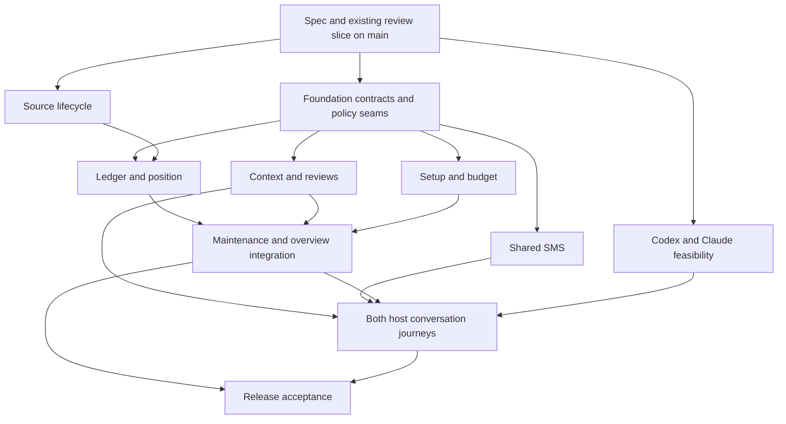

# Finance MVP implementation plan

> **For agentic workers:** Use `superpowers:executing-plans` for the assigned workstream only.
> Cooper selected separate Codex tasks, each with its own worktree, branch and PR. This orchestration
> task coordinates them; it does not perform their feature implementation.

**Goal:** Deliver the complete Finance journey in the specification, including verified two-way SMS
with both Codex and Claude and user-controlled budget automation.

**Architecture:** Domain-owned vertical features use one maintenance lifecycle and shared typed
ports for position, planning, human work, notifications and host continuation. Shared entry points
and migration publication have one integration owner; independent modules land on main in small PRs.

**Tech stack:** Existing TypeScript, Zod, Hono, Drizzle/PostgreSQL, React, typed HTTP client, MCP,
Plaid, Twilio, Vitest and Playwright. Do not upgrade dependencies as incidental Finance work.

**Spec:** [Finance MVP specification](../../product/finance-workspace-plan.md).
**Prompts:** [Task launch instructions](finance-mvp-handoffs.md).
**Baseline:** main `3d3306608c4b6f729d0c93e4e887dae2ba930d2d`, inspected 2026-09-13.

## Global constraints

- User-facing name `nohmi`; internal repository/packages `personal-os`. Introduce no former names
  or compatibility aliases; protocol replacement requires an explicit caller cutover.
- Both Codex and Claude are required at launch.
- External hosts own recurring schedules. nohmi owns durable accepted work and source sync.
- No money movement, trading, bill payment, tax filing or professional credential claims.
- Exact cents internally; unknown amounts and missing evidence are not zero.
- Knowledge never grants action authority. Explicit policy activation and version-bound approval
  remain required; global bypass never grants scopes or overrides evidence.
- Existing accounts/manual paths remain useful without SMS, agents or a complete budget.
- Every task reads the live AGENTS.md and the skills governing its changed surfaces.
- Each implementation PR runs focused verification and fresh `pnpm verify`; no merge-ready claim
  while required checks or material production evidence are absent.

## 1. Delivery model and launch gates

Six implementation tasks persist for their stream's related small PRs. A seventh task validates the
combined release. Venmo is a bounded experiment within Sources, not an eighth permanent task.
This orchestration task owns scope, decisions, sequencing, Linear, dispatch and review monitoring.
Implementation tasks own coding, tests, their branches/PRs and review fixes.

| Task | Live tracking | First dispatch |
| --- | --- | --- |
| Orchestration | [COO-45](https://linear.app/coopersully/issue/COO-45) | This task; review/publish spec and coordinate delivery |
| F — Foundations and integration | [COO-52](https://linear.app/coopersully/issue/COO-52) | F0 after docs and current review slice land |
| L — Sources and position | [COO-53](https://linear.app/coopersully/issue/COO-53), [COO-48](https://linear.app/coopersully/issue/COO-48), optional [COO-50](https://linear.app/coopersully/issue/COO-50) | L0; L1 waits for F0 |
| P — Setup and planning | [COO-54](https://linear.app/coopersully/issue/COO-54), [COO-49](https://linear.app/coopersully/issue/COO-49) | P0 after F0 |
| C — Context and reviews | [COO-47](https://linear.app/coopersully/issue/COO-47), baseline [COO-46](https://linear.app/coopersully/issue/COO-46) | C0/C1 after existing slice and F0 |
| T — Shared SMS | [COO-55](https://linear.app/coopersully/issue/COO-55) | T0 after F0 |
| H — Required host integrations | [COO-56](https://linear.app/coopersully/issue/COO-56) | H0 feasibility alongside F0 |
| Q — Release acceptance | [COO-57](https://linear.app/coopersully/issue/COO-57) | Fixture preparation, then final integration from ready main |

Dependencies refer to milestone merge commits. For example, F0 unblocks C/P/T while F1 later
consumes their results; making the entire F issue a blocking predecessor would create a false
cycle. Record milestone readiness in issue checklists with exact PR/merge evidence. Use Linear
issue-level blockers only when the whole predecessor outcome is required.

### Wave 0 — establish the baseline

1. Review this spec/plan and publish the planning docs to main through the repository PR workflow.
2. Land the existing contextual-review implementation under COO-46 independently. Do not accidentally
   classify unmerged notes behavior as part of main. Refresh verification before landing it.
3. Launch Foundations F0 and the host feasibility portion H0 from freshly fetched main. Sources L0
   can also start because provider lifecycle validation does not require the new shared contracts.
4. F0 inventories live callers, publishes the narrow contracts and reusable fixtures below, defines
   safe unavailable states, and lands the required maintenance/policy seams. No unimplemented
   operation may return success merely to unblock a consumer.

### Wave 1 — independent feature work

After F0 merges, launch Context C, Planning P and Texting T from the new main. Continue Sources L
and Hosts H. Consumers may implement against landed contracts and test adapters before their real
producer is ready, but their production adapter remains disabled or explicitly unavailable until
wired. A feature is independently mergeable only when its supported behavior works and its missing
dependency is honestly represented.

### Wave 2 — integration and release

F completes maintenance/overview integration after domain producers merge. H connects the actual
continuation path after Texting and Context land. Launch Q's final journey verification from that
main; its earlier fixture design can proceed independently. Fix domain defects in the owning stream
and repeat only affected tests plus required release verification. Both host journeys gate release.



Arrows express readiness dependencies, not a requirement to hold every upstream stream's entire
roadmap. Each numbered PR milestone below has a concrete merge gate.

## 2. Shared ownership and migration protocol

| Surface | Sole integration owner | How another stream contributes |
| --- | --- | --- |
| `apps/api/src/app.ts`, `finance-service.ts`, `routes/finances.ts` | F | Submit module plus minimal wiring diff; reserve a short edit/merge slot before changing these files |
| `packages/domain/src/index.ts`, `finance.ts`; `packages/api-client/src/features/finances.ts`; `apps/mcp/src/tools/finances.ts` | F | Domain schemas live in feature modules; F registers/exports thin calls, never rewrites their business behavior |
| Finance `overview-page.tsx`, `workspace-page.tsx`, manifest/navigation and global composition | F | L/P/C provide tested child components and typed data; F composes them |
| `packages/database/src/schema.ts`, migration SQL/journal/snapshots | F coordinates one publisher at a time | Domain owner authors invariant and schema delta in its own PR; reserve migration slot before generation/publication |
| `agent-access-work-items.ts` and Settings Reviews composition | C, exclusive registered slot | F/T supply references; C extends domain projections without editing unrelated workspace logic |
| Shared execution-policy module and global bypass editor | F | P supplies budget authorization predicate; T consumes result and never widens it |
| `texting-service.ts`, Texting routes/client/MCP and global SMS settings | T | H receives a continuation event port; C supplies an answer/context operation, not conversation access |
| Host connection/continuation modules and external setup instructions | H | F supplies run state and T accepted reply IDs; H cannot change Finance orchestration |
| Existing profile/budget modules and plan/setup/period-review UI | P | C references approved profile facts; L supplies position; other streams do not edit the profile writer |
| Provider projections, ledger/reimbursement calculators and cashflow/wealth UI | L | P/C consume facts and operations; they do not calculate independent totals |

Before generating a migration: report affected tables, constraints, rollback/repair and expected
merge slot to the orchestrator. Rebase/merge current main before generation; keep schema and migration
in the same PR. Once shared or applied, migrations are immutable. Resolve collisions with a new
corrective migration under the database skill, never renumber an already published migration.
Migration slots serialize a small publication step, not all design or implementation work.

No wholesale file move/refactor simply to make parallelism easier. F may extract a narrow feature
registration seam only when needed by an identified consumer. A shared edit slot is recorded in the
issue and released when the PR lands or the owner explicitly hands it back.

## 3. Contract handshake — F0 output

These are proposed internal interface names, not claims about shipped endpoints. F0 validates them
against existing types, publishes Zod schemas and contract tests in
`packages/domain/src/finance/workflow-contracts.ts`, and records any agreed naming change in all
consumer prompts before dispatch. Reuse existing models; do not create a second event or case store.
Tenant identity is derived from authenticated API context, never trusted from these payloads.

```ts
type RevisionRef = { id: string; revision: string };
type MoneyFact = {
  cents: number | null;
  currency: "USD";
  quality: "verified" | "qualified" | "unavailable";
  reasons: string[];
  sources: RevisionRef[];
};
type PositionEvidence = {
  revision: string;
  asOf: string;
  scope: { accountIds: string[]; from: string; through: string };
  cash: MoneyFact;
  postedSpend: MoneyFact;
  pendingExposure: MoneyFact;
  committed: MoneyFact;
  protected: MoneyFact;
  spendable: MoneyFact;
  debt: MoneyFact;
  investments: MoneyFact;
  netWorth: MoneyFact;
};
type HumanWorkRef = RevisionRef & {
  domain: "finances";
  kind: "question" | "approval" | "repair";
  actionRevision: string;
};
type FinanceAnswer = {
  operationId: string;
  work: HumanWorkRef;
  text: string;
  source: { kind: "app" | "agent" | "sms"; messageId: string | null };
};
type FinanceContext = {
  id: string;
  revision: string;
  text: string;
  validFrom: string | null;
  validThrough: string | null;
  expectedCents: number | null;
  transactionIds: string[];
  status: "active" | "partially_matched" | "matched" | "disputed" | "expired" | "canceled";
};
type DomainOutcome = {
  operationId: string;
  state: "applied" | "accepted" | "needs_input" | "pending_review" | "blocked" | "failed";
  work: HumanWorkRef[];
  resultRevision: string | null;
  reasonCode: string | null;
};
type ContinuationRequest = {
  id: string;
  connectionId: string;
  runId: string | null;
  inboundMessageId: string;
  work: HumanWorkRef[];
};
```

MoneyFact reasons are stable validated reason codes, not arbitrary provider text. Revisions are
opaque evidence tokens; cents require the existing safe integer/range validation. All date/time
fields use existing ISO schemas and lengths/lists are bounded. The full schemas add actor/provenance
and source references through existing shared types rather than duplicating authentication models.

| Port | Producer | Consumer | Required semantics |
| --- | --- | --- | --- |
| `readPosition(scope): PositionEvidence` | L | P/F | Same evidence revision across related totals; source cutoffs and affected unknowns explicit |
| `captureContext(input): FinanceContext` | C | App/F/Texting | Supports zero transaction links; actor and intent provenance preserved |
| `answerWork(input: FinanceAnswer): DomainOutcome` | C/domain action owner | App/agent/Texting | Current work/action revision, ownership and authority checked; duplicate operation returns recorded result |
| `evaluateBudget(position, planRevision, policyRevision): DomainOutcome` | P | F | Proposal/apply decision and cumulative cap under lock; no baseline mutation |
| `publishNotification(work: HumanWorkRef[]): DomainOutcome` | T | F/C/P | Resolve current domain evidence server-side; persist typed intent and dedupe by action revision |
| `requestContinuation(input: ContinuationRequest): DomainOutcome` | H | Texting/F | Durable connection-bound delivery; unavailable host yields pending/blocked, never completed Finance work |
| `resumeFinance(runId): DomainOutcome` | F | H/app/MCP | Same durable lifecycle, actor scopes, fences and verified result regardless of host |

F0 owns final endpoint/tool registration. Each port needs a real API route/client mapping before
its consumer is advertised; names in this table alone are not an API. Persisted accepted operations
have status reads and recovery owners. Every producer documents retry semantics, stale revision,
permission failure, bounds and source-of-truth identity in its contract tests.

## 4. Workstream milestones

For every numbered milestone: write the listed behavioral regression test, demonstrate its failure,
implement the smallest change, run the focused command, inspect audit/tenant behavior, update the
owning docs, commit, and open a PR with the repository `create-pr` skill after `pnpm verify`. Each
milestone is a reviewable deliverable; split further when one part can be rejected independently.

### F — Foundations, authority and maintenance integration

**Own:** `apps/api/src/finance/maintenance-service.ts`, `finance-maintenance-service.ts`,
`finance-challenge-service.ts`, `finance-status-service.ts`, composition paths in section 2.
Create `packages/domain/src/finance/workflow-contracts.ts` and its test; create narrow shared
execution-policy module/tests only after tracing current bypass consumers.

- [ ] **F0a: Caller and lifecycle cutover.** Trace current app/API/MCP start, challenge, judgment,
  approval and settle paths; choose one canonical lifecycle preserving complete candidate challenge
  coverage, source revisions, fencing, human review and immutable period review. Migrate all live
  callers in one explicit rollout with recoverable in-flight runs. Test the same input through both
  current entry points and prove they cannot bypass the canonical guard. Remove obsolete public
  names via coordinated hard cutover, with exact host setup repair guidance.
- [ ] **F0b: Publish shared contracts and global authority seam.** Add the section 3 contract schemas,
  invalid/cross-tenant/stale/duplicate cases and producer test adapters. Move the existing Finance
  bypass value to the canonical global execution setting with explicit migration semantics and
  inspectable user control. Do not silently authorize other domains during migration; existing
  per-domain authority still constrains execution. Test preservation of restrictions in Mail,
  Tasks and Calendar and exact Finance rule activation. Keep undeclared capabilities unavailable.
- [ ] **F1: Integrate domain producers.** Wire L position, C context/work, P planning/review and T
  notification ports into maintenance. Persist checkpoints/evidence and verified terminal state.
  Test interruption after one committed effect, rerun, concurrent host invocations, an answered
  question outside the current transaction page, and a run with unresolved financial uncertainty.
- [ ] **F2: Compose the daily overview.** Compose domain-owned financial position, plan status and
  outstanding work. Keep review count, snapshot and period review consistent; expose repair without
  marking missing data as healthy. Verify desktop/mobile direct-navigation paths.

**Focused checks:**
`pnpm exec vitest run apps/api/src/finance/maintenance-service.integration.test.ts apps/api/src/finance-challenge-service.integration.test.ts apps/api/src/finance-status-service.integration.test.ts`
plus the new workflow-contract and shared-policy tests.
**Merge gates:** F0a/F0b before consumers depend on their seams; F1 after L1/C1/P1; F2 after domain
components exist. F never implements the domains' matching, budget arithmetic or SMS rendering.

### L — Sources, ledger and financial position

**Own:** `packages/connectors/src/plaid.ts`, Finance provider-item services/tests;
`apps/api/src/finance/account-service.ts`, `ledger-service.ts`, `account-semantics.ts`;
`finance-reimbursement-service.ts`, `finance-allocation-projections.ts`, `finance-cashflow.ts`,
`finance-health.ts`, Finance presentation/report data; web accounts/cashflow/wealth and
`position-material.tsx`. Reserve shared registration edits with F.

- [ ] **L0: Source lifecycle and baseline proof.** Exercise Link selection, first sync, later sync,
  reconnect, exclusions, failed account, duplicate/removal and disconnect. Close specific observed
  gaps without replacing the connector. Test that a failed account qualifies affected aggregates
  while another account stays useful; provider replay does not recreate removed records.
- [ ] **L1: Canonical recognition and position.** Trace every aggregate to economic events and
  allocations, unify inconsistent paths, and implement PositionEvidence. Cover pending replacement,
  split sums, own-account transfer, investment contribution, partial reimbursement, fees, currency
  and ownership uncertainty. Update cashflow/wealth views and API results from the same calculations.
- [ ] **L2: Position recovery and correction.** A manual correction invalidates dependent projections;
  stale source revisions cannot overwrite it. Verify liability sign, protected funds, bill timing,
  account deletion/exclusion and incomplete coverage. Preserve immutable historical reviews.
- [ ] **LV: Optional Venmo proof.** Execute only the read-only and consented steps in the feasibility
  record. Return explicit go/no-go evidence, cost/latency and wallet fields. A go requires a separate
  bounded implementation PR; a no-go completes research without blocking Finance launch.

**Focused checks:**
`pnpm exec vitest run apps/api/src/finance/account-ledger-service.integration.test.ts apps/api/src/finance-reimbursement-service.integration.test.ts apps/api/src/finance-cashflow.test.ts apps/api/src/finance-provider-item-sync-service.integration.test.ts apps/web/src/features/finances/position-pages.test.tsx`
**Merge gates:** L0 can merge independently; L1 needs F0 schemas; downstream budget application waits
for L1. No runtime Venmo scraping or upload workaround.

### P — Guided setup, goals, budget boundaries and period review

**Own:** `apps/api/src/finance/setup-service.ts`, `profile-budget-service.ts`,
`profile-version-lock.ts`, `finance-planning.ts`, `finance-period-review-service.ts`;
`packages/domain/src/finance/profile.ts`, `budget.ts`; web setup/profile/plan/period-review components.
Create `apps/api/src/finance/budget-policy-service.ts` and tests for explicit bounded revisions.

- [ ] **P0: Complete setup and first plan.** Extend resumable questions for income reliability,
  obligations/timing, reserves, debt, goals and protected priorities. Reuse confirmed answers and
  disclose assumptions. Test interrupted setup, missing budget, variable income, a deficit,
  concurrent profile change and independent manual bookkeeping. Reconcile existing profile writers
  rather than add another source of truth.
- [ ] **P1: Bounded revisions.** Persist versioned user policy, inactive proposal, exact preview,
  activation, expiry/disable and cumulative monthly usage. Validate active plan and L position
  revisions under lock. Reject increases to assumed income/borrowing/protected-fund releases unless
  separately approved. Preserve original baseline for variance and review.
- [ ] **P2: Goals and useful period review.** Show evidence-backed goal progress, unfunded priorities,
  debt/bill pressure and plan/actual variance. Explain material over- and underspending relative to
  user priorities. Produce an immutable review with source cutoff, uncertainty and action links.
  Test contribution versus return, expected versus received income, historical correction and
  an incomplete month. Research any specialist recommendation before claiming its applicability.

**Focused checks:**
`pnpm exec vitest run apps/api/src/finance/setup-service.integration.test.ts apps/api/src/finance/profile-budget-service.integration.test.ts apps/api/src/finance-period-review-service.integration.test.ts apps/web/src/features/finances/plan-page.test.tsx`
plus `budget-policy-service.integration.test.ts` when created.
**Merge gates:** P0 after F0; P1 may merge proposal/policy management before L1 only with execution
unavailable. Enabling automatic revisions requires L1 and F's authority seam. P2 requires L facts.

### C — Context, questions, manual control and unified Reviews

**Own:** `apps/api/src/finance/inbox-service.ts`, `packages/domain/src/finance/inbox.ts`, web
inbox/review/transaction-inspector components; shared Reviews projection under its exclusive slot.
Create `apps/api/src/finance/context-service.ts`, domain `finance/context.ts`, and matching tests.
Own the minimum typed User Knowledge producer/adapter needed for promoted facts, coordinating
existing shared records before adding any persistence.

- [ ] **C0: Finish the current case slice.** Verify COO-46 has landed; inspect rather than duplicate
  its contextual list, notes and manual actions. Migrate/project remaining Finance questions,
  approvals and user-required repairs into the same stable work identity with exact domain actions.
- [ ] **C1: Prospective notes and responses.** Add capture without a transaction, explicit temporal
  validity, source/actor revision, lifecycle and bounded suggested matches. Implement FinanceAnswer
  with atomic stale checks and recorded idempotent result. Test a changed answer, unmatched remainder,
  expired/canceled note, two plausible expenses and a user resolving the item before agent resumption.
- [ ] **C2: Learn without granting authority.** Keep one-off context in Finance; propose reusable
  typed facts with provenance/sensitivity and allow inspection/correction. Use shared knowledge
  schemas/storage for reusable facts, not a Finance-only global memory table. Deliver structured
  purpose-bound retrieval and conflicts; defer semantic indexing and automatic promotion breadth.
- [ ] **C3: Complete manual parity.** Users can inspect full contextual evidence, categorize, split,
  link, defer/dismiss and review history. SMS/app/MCP resolve the same record; pagination and tenant
  filters are structural. Distinguish a recorded answer from a resolved financial operation.

**Focused checks:**
`pnpm exec vitest run apps/api/src/finance/inbox-service.integration.test.ts apps/api/src/agent-access-work-items.integration.test.ts apps/web/src/features/finances/inbox-list.test.tsx apps/web/src/features/finances/review-page.test.tsx`
plus new context/knowledge tests.
**Merge gates:** C0 after COO-46; C1 after F0. Matching application calls L operations and cannot
create unsupported economic relationships. T consumes C1; no Finance module reads the SMS inbox.

### T — Shared notification policy and Finance SMS conversations

**Own:** Texting service/routes/client/MCP/UI/domain and Twilio adapter when required; create shared
notification policy/outbox and inbound coordinator modules with their tests. F owns global bypass;
T owns global channel settings and Finance overrides through a domain-owned settings component.

- [ ] **T0: Typed actionable notifications.** Persist intents referencing domain work. Implement
  shared eligibility, action-revision dedupe, quiet hours, reminders and privacy; Texting renders
  at send time. Test resolved work during quiet hours, date rollover, three-item limit, overflow,
  wrong tenant, material versus wording change, STOP and uncertain provider result.
- [ ] **T1: Durable inbound coordination.** Enqueue after durable receipt, claim/fence once, bind
  replies to current message/work revisions, route Finance answers or prospective context through
  C ports, and persist outcome. Clarify ambiguous routing. Test delayed multi-item replies, stale
  yes, duplicate webhook, crash after domain commit and authenticated deep-link return after login.
- [ ] **T2: Conversation completion and recovery.** Deliver prompt honest acknowledgment, request H
  continuation, compose domain-confirmed results and expose waiting/failed/uncertain states.
  Implement exact reversible SMS approvals under F authority; stronger approvals deep-link to app.
  Enforce transport consent and retry semantics without duplicate texts.

**Focused checks:**
`pnpm exec vitest run apps/api/src/texting-service.integration.test.ts apps/api/src/routes/texting.test.ts packages/connectors/src/twilio.test.ts`
plus new notification-policy and inbound-coordinator integration tests.
**Merge gates:** T0 after F0; T1 requires C1 operation; T2 host dispatch remains unavailable until H
adapter proof. Do not build arbitrary multi-workspace reasoning to complete this Finance slice.

### H — Codex and Claude setup, continuation and health

**Own:** new `apps/api/src/automation-host-continuation-service.ts` and domain
`automation-host-continuation.ts`, typed host adapter modules, external-host setup/health component,
`docs/product/automation-hosts.md` and setup instructions. Coordinate route/schema registration with
F and external network/callback configuration with T.

- [ ] **H0: Two-host feasibility gate.** Identify the exact Codex and Claude product surfaces,
  supported unattended MCP/API use, read/write permission behavior, session lifetime, event/API
  trigger or host-owned follow-up schedule, runtime availability, cadence, limits and cost. Verify
  current official documentation and run bounded authorized probes. Codex app versus SDK and
  Claude Code versus Cowork are separate capabilities. Report unsupported required behavior early.
- [ ] **H1: Reproducible setup and health.** Setup records a connection-bound immutable local schedule
  identity, declared host identity/cadence, scopes and last observed invocation. Guided host-side
  setup performs host-authorized schedule configuration; nohmi never originates the schedule.
  Repair is per connection/schedule, including multiple schedules for one workspace.
- [ ] **H2: Durable continuation.** Consume ContinuationRequest through an allowlisted supported
  adapter with bounded transport, encrypted credentials, dedupe, retry/outbox and status. Do not
  send arbitrary callback URLs or put sensitive SMS bodies/tokens in host metadata. A host retrieves
  purpose-bound work with its own credential. Ambiguous dispatch cannot be retried into a storm.
- [ ] **H3: Prove both real journeys.** For each host: invoke maintenance, send one authorized test
  question, end the original session, answer by SMS, continue automatically and verify the exact
  domain result. Measure latency/usage, offline recovery and duplicate invocation. Run both against
  the same scoped work to verify effects and notifications remain single.

**Focused checks:** create
`apps/api/src/automation-host-continuation-service.integration.test.ts` and
`packages/domain/src/automation-host-continuation.test.ts`;
run `pnpm exec vitest run` with those exact paths plus affected API-client/MCP tests.
**Merge gates:** H0 can start in Wave 0; H1 after F0; H2 after T's event contract; H3 after C/T/F
integration. Production evidence is required for both hosts, not a unit-test substitute.

### Q — Integrated acceptance and release evidence

**Own:** `e2e/finance-mvp.spec.ts`, `e2e/finance-sms.spec.ts`, scenario fixtures under
`e2e/fixtures/finance-mvp/`, and a sanitized release evidence document. Modify existing fixture loader
only in a reserved integration slot. Own test/release artifacts, not domain implementation fixes.

- [ ] **Q0: Encode the acceptance scenarios below.** Use existing fixture conventions and real
  persistence/API operations; mock only external boundaries. Include two tenants and repeatable
  reset/setup, desktop and mobile views. Avoid fixed sleeps; observe domain/provider states.
- [ ] **Q1: Full direct-user journey.** New user, manual/connected account paths, plan approval,
  normal month, ambiguity/context, correction, recurring maintenance and period review. Verify
  snapshot, ledger, budget, cashflow, wealth and Reviews against the same expected facts.
- [ ] **Q2: Cross-channel and failure journey.** Duplicate/reordered webhooks, manual resolution
  race, stale proposal, source outage, revoked host, interrupted run and recovery. Demonstrate
  that successful siblings remain recorded and no irreversible effect is invented.
- [ ] **Q3: Release acceptance.** Fresh required repository checks, migration rehearsal and separate
  Codex/Claude/SMS/provider production-equivalent evidence. Record exact commits, safe correlation
  IDs, times, outcomes and remaining limitations. Host or sender configuration alone is insufficient.

**Focused checks:** `pnpm exec playwright test e2e/finance-mvp.spec.ts e2e/finance-sms.spec.ts` using
the checked-in lifecycle runtime; full `pnpm verify` before release. Do not run competing full
browser/container suites in several local tasks simultaneously; the orchestrator reserves capacity.

## 5. Deterministic fixture oracle

These synthetic examples define financial expectations independently of implementation functions.
Q publishes reusable fixture records after consulting existing seed utilities; L/P/C reuse them.
No user's actual transactions or phone numbers belong in fixtures.

```json
[
  {"case":"partial_reimbursement","purchaseCents":12000,"receivedCents":4000,"expectedUnreceivedCents":2000,"netPostedSpendCents":8000},
  {"case":"wallet_cashout","receivedReimbursementCents":4000,"cashoutCents":4000,"additionalIncomeFromCashoutCents":0},
  {"case":"own_account_transfer","debitCents":25000,"creditCents":25000,"spendCents":0,"netWorthDeltaCents":0},
  {"case":"position","cashCents":100000,"investmentsCents":50000,"debtCents":20000,"netWorthCents":130000},
  {"case":"cash_capacity","cashCents":100000,"distinctFutureBillsCents":50000,"distinctProtectedCents":10000,"unreflectedPendingCents":5000,"candidateSpendableCents":35000},
  {"case":"missing_obligations","cashCents":100000,"obligationCoverage":"unknown","definitiveSpendableCents":null},
  {"case":"cumulative_policy","monthlyCapCents":10000,"alreadyUsedCents":6000,"concurrentRequestsCents":[3000,3000],"maximumAdditionalAppliedCents":3000}
]
```

The cash-capacity fixture explicitly makes bills, protected funds and pending exposure disjoint and
not already reflected in the cash balance. Add a second fixture where pending is reflected and a
bill is already reserved; subtract each once. Assertions must cover both rather than encode a
universal subtraction formula. For the policy race, assert at most one request applies and the
other returns a proposal/rejection with current cap usage; either lock winner is valid.

Additional lifecycle cases: pending amount changes before posting; recurring biweekly timing across
month boundaries; late reimbursement into a later month; superseded work revision; reply with two
possible targets; canceled expectation; corrected reusable fact; provider deleted transaction;
zero changes with unresolved questions; failed host dispatch after accepted Finance work. Each
assertion names expected amounts, work states, audit identity and side-effect count.

## 6. PR, monitoring and launch protocol

Every implementation task starts in a new saved-project worktree based on freshly fetched main.
Record the exact base commit and required prerequisite merge commits. If a prerequisite is absent,
wait or take another ready milestone; never base a task on a peer's unmerged branch or cherry-pick
unreviewed work. After one milestone merges, the same task can use a new branch from fresh main for
its next ready milestone. PRs target main and remain independently reviewable.

Before task creation the orchestrator resolves the live nohmi project, current issues, main and
open PRs. A task gets one stream prompt, spec/plan paths, exact issue IDs, allowed/forbidden files,
prerequisites and its first milestone. It reads current instructions after checkout. Do not embed
private financial context or copy this conversation as the implementation specification.

Tasks implement, commit, push, open PRs using `create-pr`, resolve review comments, and report
status with exact SHA, tests and blockers. Opening a PR is authorized for implementation tasks;
merging/deploying remains subject to the user's launch/merge direction and repository workflows.
The orchestrator reviews dependency readiness, scope and verification before recommending a merge.
Keep Linear issues In Progress for active/open-PR work; never mark a release item Done from code alone.

During implementation, use compact task status waits and bounded CI/review checks. Notify the user
on actionable blockers, scope decisions, ready merges and completed milestones, not every poll.
Persistent background monitoring begins only when implementation tasks exist, through one thread
heartbeat that stays quiet on unchanged state. It is not a Finance maintenance scheduler. This
planning pass creates no idle monitoring automation and no implementation tasks.

Every merge triggers: verify exact main and CI, mark dependent milestones ready, fetch main before
next dispatch, release shared edit/migration slots and update Linear links. Archive finished tasks
only after their work is merged or deliberately abandoned and no follow-up remains. Preserve the
orchestrator as the durable project entry point.

## 7. Scope coverage and final planning check

| Spec requirement | Primary stream | Required collaborators |
| --- | --- | --- |
| F1 sources and coverage | L0 | F composition, Q |
| F2 ledger and position | L1/L2 | C evidence, P interpretation, Q |
| F3 setup and plan | P0/P2 | L facts, C knowledge, H host setup |
| F4 authority/maintenance | F0/F1, P1 | C questions, T notifications |
| F5 questions/context/manual | C0–C3 | L operations, F shared views |
| F6 both-host SMS | T0–T2, H0–H3 | C answers, F run/authority |
| F7 review and advice | P2 | L facts, F settlement, Q |
| Isolation/recovery/release | Every owner, Q | Orchestrator evidence gate |
| Optional Venmo | LV / COO-50 | Separate go/no-go; no release dependency |

A task cannot declare its stream complete while any assigned requirement lacks implementation and
verification evidence. Record an explicit product decision for any scope reduction before rewriting
acceptance; do not quietly reinterpret the MVP to fit the current change list.
